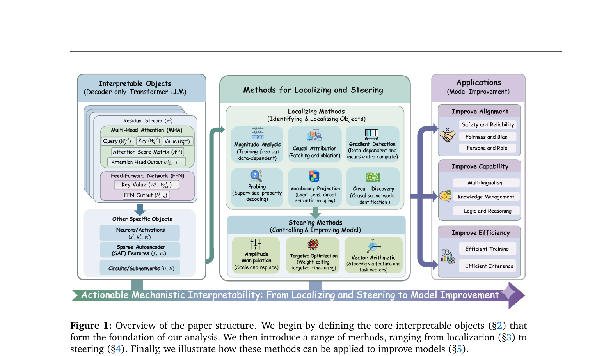

# Locate, Steer, and Improve 阅读笔记

## 1. 基本信息
- 论文标题：Locate, Steer, and Improve: A Practical Survey of Actionable Mechanistic Interpretability in Large Language Models
- 类型：Survey
- 方向关键词：Mechanistic Interpretability, Actionable Interpretability, Localizing, Steering, Activation Steering, Causal Attribution, SAE, Knowledge Editing, Model Alignment
- 阅读日期：2026-06-05

## 2. 这篇综述想解决什么问题？
- 传统 MI 综述的问题：
  - 传统综述更多把 Mechanistic Interpretability 当作 observational science，侧重解释模型内部现象、梳理 theoretical foundations 和 technical roadmaps，但不够强调如何把解释结果转化成 actionable intervention。
  - 现有综述对实际应用场景下的 MI 方法分类和定义不够清晰，容易混淆 diagnostic tools 和 intervention techniques。
  - application coverage 不够完整，method illustration 偏 high-level，难以直接指导“localization 之后如何修改 model behavior”。
- 本文提出的主线：
  - 用 “Locate, Steer, and Improve” 组织 actionable MI：先 localize 与 behavior 相关的 Core Interpretable Objects，再通过 Steering Methods 干预这些 objects，最后服务于 alignment、capability 和 efficiency 的改进。
  - 论文强调严格的 pipeline-driven framework：Localizing 是 diagnosis，Steering 是 intervention，Applications 是把 internal mechanism 改进落实到 model capability 和 safety 上。
  - 每类方法都尽量给出 Applicable Objects、Scope 和 Methodological Formulation，帮助从“understand the model”走向“control and improve the model”。
- 总结：
  - 这篇综述把 MI 从“解释 model internals”推进到“localize key internal objects，并用 controllable intervention 改善 model behavior”的 practical framework。

## 3. 总体框架

图 1 给出了本文的整体结构：先定义 decoder-only Transformer LLM 中可以被分析的 Interpretable Objects，再把方法分为 Localizing Methods 和 Steering Methods，最后连接到 Alignment、Capability 和 Efficiency 三类 model improvement application。它说明了本文的组织方式和主要术语关系。

- Core Interpretable Objects：
  - Token Embedding：输入 token 的表示，是模型处理语义和位置相关信息的起点。
  - Transformer Block and Residual Stream：重点关注 transformer block 和 residual stream；residual stream 常被视为 information accumulation 和 intervention 的主通道。
  - Multi-Head Attention (MHA)：attention head 可作为 information routing、copying、retrieval 或 pattern recognition 的候选对象。
  - Feed-Forward Network (FFN)：FFN / MLP 常被认为与 factual knowledge、feature transformation 和 localized functional units 相关。
  - Sparse Autoencoder (SAE) Feature：SAE feature 用于把难解释的 high-dimensional activation 拆成更 sparse、更 interpretable 的 concept / functional feature。
- Localizing Methods：
  - 目标是识别哪些 neuron、attention head、activation、FFN、SAE feature 或 circuit 对特定 behavior 负责。
  - 它是 diagnostic step，把巨大 search space 缩小到 manageable functional units。
  - 主要方法包括 Magnitude Analysis、Causal Attribution、Gradient Detection、Probing、Vocabulary Projection 和 Circuit Discovery。
- Steering Methods：
  - 目标是在 localization 之后操控这些 internal units，引导 model output，实现对 LLM generation process 的 controlled intervention。
  - 主要方法包括 Amplitude Manipulation、Targeted Optimization 和 Vector Arithmetic。
  - Steering 可以是临时的 inference-time intervention，也可以是更持久的 parameter / localized weight modification。
- Applications：
  - Improve Alignment：Safety and Reliability、Fairness and Bias、Persona and Role。
  - Improve Capability：Multilingualism、Knowledge Management、Logic and Reasoning。
  - Improve Efficiency：Efficient Training 和 Efficient Inference。

## 4. 方法分类表
| 类别 | 方法 | 操作对象 | 是否因果 | 成本 | 我是否需要重点掌握 |
|---|---|---|---|---|---|
| Localizing | Magnitude Analysis | neuron / SAE feature / attention head / activation / weight | 弱 | 低 | 是 |
| Localizing | Causal Attribution | activation / head / FFN / residual stream / circuit | 强 | 高 | 是 |
| Localizing | Gradient Detection | parameter / activation / neuron / feature | 中 | 中 | 是 |
| Localizing | Probing | hidden state / layer representation / residual stream | 弱到中 | 中 | 是 |
| Localizing | Vocabulary Projection | hidden state / residual stream / unembedding space | 弱 | 低 | 可复查 |
| Localizing | Circuit Discovery | attention head / MLP / residual stream / multi-component path | 强 | 高 | 是 |
| Steering | Amplitude Manipulation | neuron / feature / head / activation magnitude | 中 | 低到中 | 是 |
| Steering | Targeted Optimization | specific weights / localized module / edited parameter subset | 强 | 中到高 | 是 |
| Steering | Vector Arithmetic | residual stream / activation direction / task vector / persona vector | 中 | 低 | 是 |
