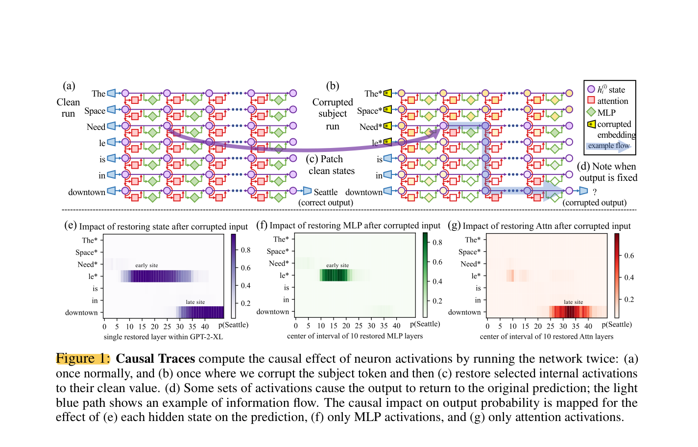
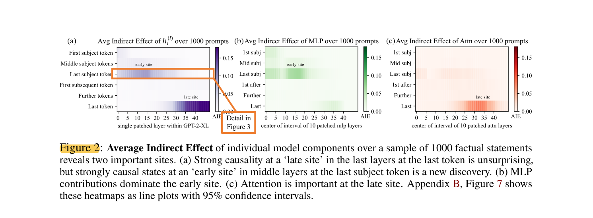
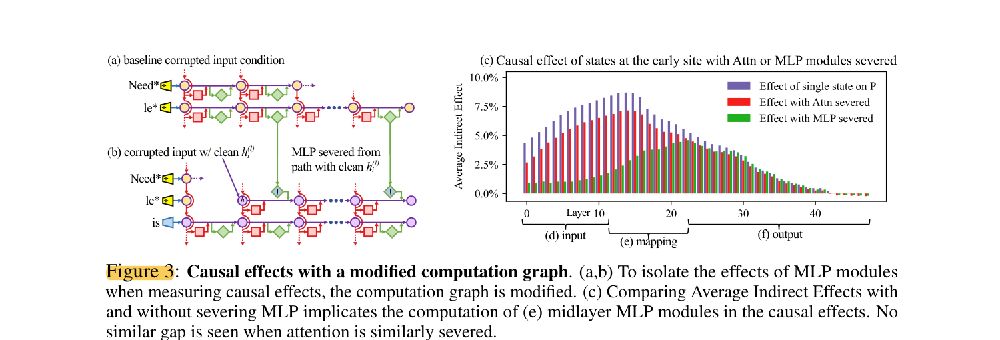

# ROME 阅读笔记

## 1. 基本信息
- 论文标题：Locating and Editing Factual Associations in GPT
- 方法名称：Rank-One Model Editing (ROME)
- 方向关键词：Factual Associations, Causal Tracing, Causal Mediation Analysis, MLP, Hidden State, Average Indirect Effect, Knowledge Editing
- 阅读日期：2026-06-05

## 2. 开头部分：本文想解决什么问题？
- 核心问题：
  - 论文想研究 GPT-like autoregressive transformer 中 factual associations 是如何存储和召回的。
  - 想判断 factual knowledge 是否对应某些 localized、directly-editable computations。
- 本文的两步思路：
  - 第一步是用 Causal Mediation Analysis 追踪 hidden state activations 对 factual prediction 的 causal effect，从而定位哪些 module 在 recall 某个 subject 的 fact 时起关键作用。
  - 第二步是用 ROME 修改 feed-forward weights，测试这些 localized computation 是否真的可以被直接编辑。
- 主要结论：
  - 在处理 subject tokens，尤其是 subject name 的 last token 时，middle-layer feed-forward MLPs 对 factual prediction 有明显作用。
  - ROME 的目标是修改 feed-forward weights 来更新 specific factual associations。
  - 论文声称 ROME 在 zsRE model-editing task 上有效，并且在 counterfactual assertions 数据集上同时保持 specificity 和 generalization。

## 3. Figure 1：Causal Tracing 的基本实验设计

- Figure 1 说明 Causal Tracing 如何把 factual recall 变成可干预的实验：
  - clean run：正常输入 factual prompt，例如 “The Space Needle is in downtown ...”，模型应输出 “Seattle”。
  - corrupted subject run：在 token embedding 之后，对 subject tokens 对应的初始 embedding 加 Gaussian noise，使模型无法稳定识别 subject，从而降低正确 object 的预测概率。
  - corrupted-with-restoration run：在 corrupted run 的基础上，把某个 token / layer 的 hidden state 恢复为 clean value，观察正确答案概率是否恢复。
- 我的理解：
  - 这里有两个关键位置：
    - early site：middle layers、subject 的 last token，也就是图里 “le*” 那一行附近。
    - late site：later layers、last token，也就是模型马上要输出答案的位置。
  - 如果恢复某个 hidden state 后，正确 object 的概率明显上升，说明这个 hidden state 对 factual recall 有较强 causal importance。
  - Figure 1(e)(f)(g) 分别看 restoring hidden state、MLP activations、attention activations 后的影响，在后面会区分 MLP 和 attention 的作用做铺垫。

## 4. Section 2：Interventions on Activations for Tracing Information Flow
- 论文把一个 fact 表示成 knowledge tuple：
  - `t = (s, r, o)`
  - `s` 是 subject，`r` 是 relation，`o` 是 object。
- 这个抽象的意义：
  - 它把“事实知识”从自然语言描述变成可操作的实验对象。
  - 实验中给 GPT 一个描述 `(s, r)` 的 natural language prompt，再观察模型是否预测出 `o`。
- autoregressive transformer 的基本设定：
  - 输入 token sequence `x = [x1, ..., xT]`。
  - 每个 token 在每层都有 hidden state `h_i^(l)`。
  - 最终 next-token prediction 从 last hidden state `h_T^(L)` 解码得到。
- 论文把 model computation 可视化成一个 hidden state grid：
  - 横向是 layers。
  - 纵向是 tokens。
  - 每层会加入 attention contribution 和 MLP contribution。
  - autoregressive setting 下，每个 token 只能看到自己及之前的token。

## 5. Figure 2：Average Indirect Effect 看到两个 site

- Figure 2 是在 1000 个 factual statements 上统计 Average Indirect Effect (AIE)。
- 主要观察：
  - late site：last token 的 later layers 有强 causal effect，这比较符合直觉，因为这里接近最终输出。
  - early site：last subject token 的 middle layers 也有强 causal effect，这是论文强调的新发现。
  - early site 主要由 MLP contributions 主导。
  - attention 在 late site 的作用更明显，尤其是在 prompt 的最后一个 token 附近；这可能对应把前面 subject 位置形成的事实信息传递到最终预测位置。
- 我的理解：
  - 论文不是只说“某层重要”，而是同时定位到 token position 和 layer range。
  - 对 factual recall 来说，关键并不只在最终输出位置；subject 最后一个 token 的 middle layers 可能已经在做与 fact retrieval / mapping 相关的计算。

## 6. Section 2.1：Causal Tracing of Factual Associations
- Causal Tracing 的目标：
  - 找出哪些 intermediate variables / hidden states 在 factual recall 中更重要。
  - 方法上属于 Causal Mediation Analysis，用 intervention 而不是只看 correlation。
- 三种运行方式：
  - clean run：正常输入，记录所有 hidden activations。
  - corrupted run：破坏 subject embeddings，模型通常不能正确预测 object。
  - corrupted-with-restoration run：在 corrupted run 中把某个 `h_i^(l)` 替换回 clean value，看是否恢复正确 object 的概率。
- 关键指标：
  - Total Effect (TE)：clean prediction probability 和 corrupted prediction probability 的差。
  - Indirect Effect (IE)：在 subject 仍被 corrupted 的情况下，只恢复某个 mediator state 后，object probability 相对 corrupted baseline 的提升。
  - Average Indirect Effect (AIE)：在多个 statements 上平均后的 IE。
- 结论：
  - AIE 高说明某个 hidden state / module 对恢复 factual prediction 有较强 causal effect。
  - 但这仍然是在特定 corruption、restoration 和 prompt setup 下得到的 causal evidence，不应直接等同于“所有事实都只存储在这一处”。

## 7. Figure 3 与 Section 2.2：Causal Tracing Results

- Section 2.2 的实验设置：
  - 在 1000 个 factual statements 上计算 AIE。
  - mediator 覆盖不同 token positions、不同 layers，以及 individual states、MLP layers、attention layers。
  - 实验对象是 GPT-2 XL。
- 论文报告的结果：
  - 在 last subject token 的 middle layers，individual states 有明显 AIE。
  - MLP 在 early site 的 contribution 更强；论文中 MLP contribution peak 大约为 AIE 6.6%。
  - attention 在 last subject token 的作用较弱，而在 prompt 的 last token / late site 更重要。
- Figure 3 的作用：
  - Figure 3 通过 modified computation graph 进一步测试 early site 的 causal effect 是否依赖后续 MLP computation。
  - (a) 是普通的 corrupted input condition。
  - (b) 在插入 clean `h_i^(l)` 的同时，切断从该 state 到后续 MLP 的路径，把 MLP output 固定在 corrupted baseline 的值，从而观察 `h_i^(l)` 的 effect 有多少是通过后续 MLP path 实现的。
  - (c) 中很多原本的 causal effect 在 severing MLP 后消失，说明 early hidden state 的作用不只是自身直接包含最终答案，而是需要经过后续 middle-layer MLP computation 才能转化成 factual recall information。
- 结论：
  - factual recall 中存在一个比较明显的 early site：middle layers + subject last token。
  - 这个 early site 的 causal effect 更可能与 MLP computation 有关。
  - late site 仍然重要，在更接近输出阶段时，attention 的作用更明显。
  - 作者据此提出一个 hypothesis：localized midlayer MLP key-value mapping 可能负责 recall subject 相关的 facts。
